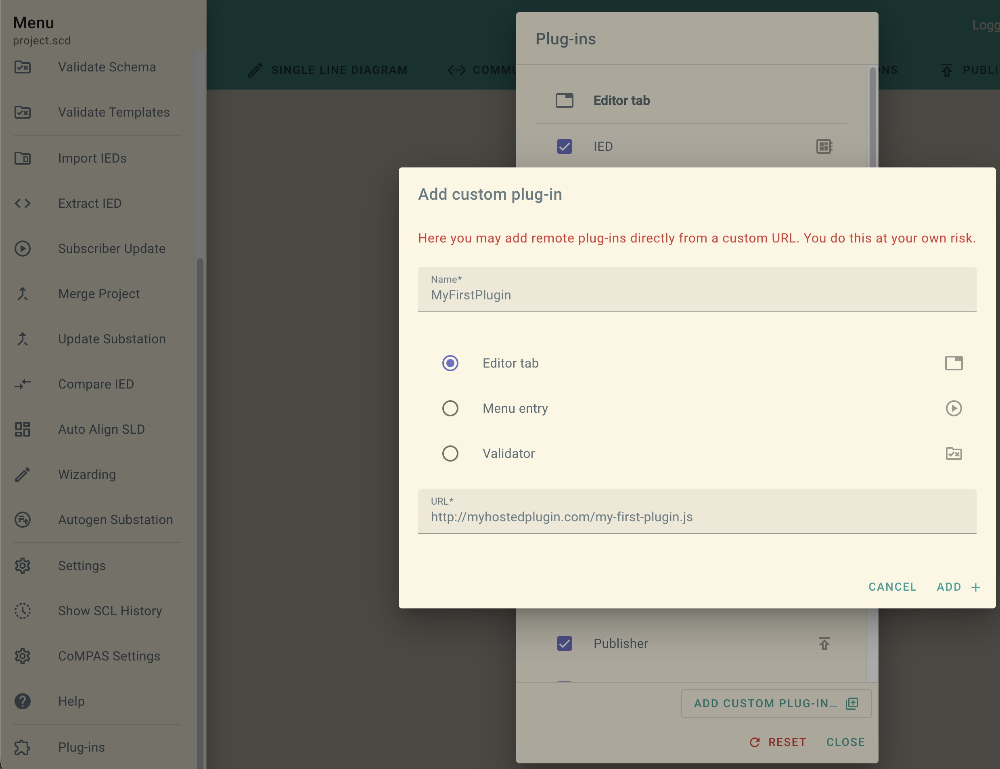

# CoMPAS Plugin Tutorial

Learn how to build your own plugins for [CoMPAS](https://github.com/com-pas/compas-open-scd), step by step.

This repo gives you a small dev environment and a hands-on tutorial. You open an SCL file, pick a tutorial step, read the comments in the code and change things. The plugin reloads as soon as you save, so you see the result right away.

## Requirements

- [Node.js](https://nodejs.org/) 22 or newer
- A modern browser
- Some JavaScript or TypeScript knowledge

## Getting started

```bash
npm install
npm run dev
```

Then open http://localhost:5173 in your browser:

1. Load the example file [`scl/example.scd`](scl/example.scd)
2. Pick `tutorial/01-hello-world.js` from the dropdown
3. Open [`src/plugins/tutorial/01-hello-world.ts`](src/plugins/tutorial/01-hello-world.ts) in your editor and follow along

Once you're done, move on to the next step.

## The tutorial

| Step | What you learn |
| ---- | -------------- |
| [01 Hello world](src/plugins/tutorial/01-hello-world.ts) | What a plugin is |
| [02 Properties](src/plugins/tutorial/02-properties.ts) | Reading the document and reacting to changes |
| [03 Set attributes](src/plugins/tutorial/03-set-attributes.ts) | Changing attributes |
| [04 Insert](src/plugins/tutorial/04-insert.ts) | Adding new elements |
| [05 Remove](src/plugins/tutorial/05-remove.ts) | Removing elements |
| [06 Complex edits](src/plugins/tutorial/06-complex-edits.ts) | Many changes with a single undo |

## Project structure

```
scl/            Example SCL file to play with
src/
  plugins/      Your plugins. Every file here becomes a plugin
    tutorial/   The tutorial steps
  utils/        Shared helpers and tests (not plugins)
  dev-shell/    The small dev app that runs your plugin
```

Want to write your own plugin? Create a new `.ts` file anywhere in `src/plugins/`. It shows up in the dropdown automatically.

## Scripts

| Command | What it does |
| ------- | ------------ |
| `npm run dev` | Start the dev environment with hot reload |
| `npm test` | Run the tests |
| `npm run build` | Build all plugins into `dist/` |
| `npm run preview` | Preview the built plugins |

## Deployment and integration

### Deploy to GitHub Pages

The easiest way to host your plugins is GitHub Pages, and it's already set up for you. Every push to `main` runs the tests, builds the plugins and publishes them to the `gh-pages` branch.

You only need to turn it on once: in your GitHub repo go to **Settings > Pages** and select the `gh-pages` branch as the source.

After that your plugins are online at:

```
https://<your-user>.github.io/<your-repo>/plugins/tutorial/01-hello-world.js
```

The start page `https://<your-user>.github.io/<your-repo>/` lists all plugin URLs, so you can just copy the one you need.

### Add your plugin to CoMPAS

There are three ways to get your plugin into CoMPAS.

**1. By URL**

The quickest way to try your plugin.

1. Open a CoMPAS environment, for example the demo at https://demo.compas.energy/
2. Open the **Menu** and scroll down to **Plug-ins**
3. Click **Add Custom Plugin**
4. Enter a **Name** for your plugin
5. Select the **Editor** tab
6. Paste the URL of your plugin



Use your GitHub Pages URL here. A `localhost` URL won't work.

**2. In `plugins.js`**

If you want your plugin to be part of CoMPAS for everyone, add it to the `plugins.js` file of CoMPAS. For this you need your own fork of [CoMPAS OpenSCD](https://github.com/com-pas/compas-open-scd).

```js
{
  name: 'My Plugin',
  src: 'https://<your-user>.github.io/<your-repo>/plugins/my-plugin.js',
  icon: 'extension',
  kind: 'editor',
  requireDoc: true,
  activeByDefault: true,
},
```

**3. Plugin Hub**

Coming soon.

## References

- [CoMPAS OpenSCD](https://github.com/com-pas/compas-open-scd)
- [Plugin API](https://github.com/openscd/oscd-api/blob/main/docs/plugin-api.md)
- [Theming](https://github.com/openscd/oscd-api/blob/main/docs/theming.md)
- [Custom Elements (MDN)](https://developer.mozilla.org/en-US/docs/Web/API/Web_components/Using_custom_elements)
